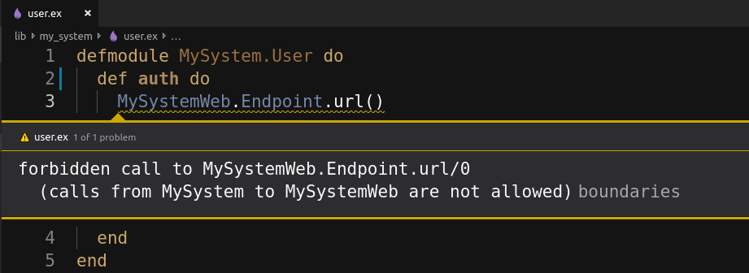

# Boundary

Boundary is a library which helps managing and restraining cross-module dependencies in Elixir projects.

## Status

Highly experimental, untested, and unstable.

## Documentation

For a detailed reference see moduledoc [here](lib/boundary.ex) and [here](lib/mix/tasks/compile/boundary.ex).

## Basic usage

To use this library, you first need to define the boundaries of your project. A __boundary__ is a named group of one or more modules. Each boundary exports some (but not all!) of its modules, and can depend on other boundaries. During compilation, the boundary compiler will find and report all cross-module function calls which are not permitted according to the boundary configuration.

### Example

The following code defines boundaries for a typical Phoenix based project generated with `mix phx.new`.

```elixir
defmodule MySystem do
  use Boundary, deps: [], exports: []
  # ...
end

defmodule MySystemWeb do
  use Boundary, deps: [MySystem], exports: [Endpoint]
  # ...
end

defmodule MySystem.Application do
  use Boundary, deps: [MySystem, MySystemWeb]
  # ...
end
```

The configuration above defines three boundaries: `MySystem`, `MySystemWeb`, and `MySystem.Application`.

Boundary modules are determined automatically from the boundary name. For example, the `MySystem` boundary contains the `MySystem` module, as well as any module whose name starts with `MySystem.` (e.g. `MySystem.User`, `MySystem.User.Schema`, ...).

The configuration specifies the following rules:

  - Modules residing in the `MySystemWeb` boundary are allowed to invoke functions from modules exported by the `MySystem` boundary.
  - Modules residing in the `MySystem.Application` namespace are allowed to invoke functions from modules exported by `MySystem` and `MySystemWeb` boundaries.

All other cross-boundary calls are not permitted.

Next, you need to add the mix compiler:

```elixir
defmodule MySystem.MixProject do
  use Mix.Project

  def project do
    [
      compilers: [:phoenix, :gettext] ++ Mix.compilers() ++ [:boundary],
      # ...
    ]
  end

  # ...
end
```

Boundary rules are validated during compilation. For example, if we have the following code:

```elixir
defmodule MySystem.User do
  def auth do
    MySystemWeb.Endpoint.url()
  end
end

```

The compiler will emit a warning:

```
$ mix compile

warning: forbidden call to MySystemWeb.Endpoint.url/0
  (calls from MySystem to MySystemWeb are not allowed)
  (call originated from MySystem.User)
  lib/my_system/user.ex:3
```

The complete working example is available [here](test/fixtures/my_system).

Because `boundary` is implemented as a mix compiler, it integrates seamlessly with editors which can work with mix compiler. For example, in VS Code with [Elixir LS](https://github.com/JakeBecker/vscode-elixir-ls):




## Troubleshooting

### Boundary loads the application

Boundary loads the applications because it needs to fetch module attributes.
If you're loading your application in your code, for example in test. Treat the case when the application is already loaded as a success case.

```elixir
case Application.load(:my_app) do
  :ok -> :ok
  {:error, {:already_loaded, :my_app}} -> :ok
end
```

## Known Issues

* Boundary will report incorrect invalid calls when multiple modules are defined in the same file (which often happens with Protocol implementations)
  * This is caused by an Elixir bug that will be fixed in 1.10 (but will also be solved by moving to compilation tracers in https://github.com/sasa1977/boundary/issues/7)
  * More info in the Elixir bug report: https://github.com/elixir-lang/elixir/issues/9322
  * As a workaround do not define multiple modules in one file (especially modules that are not in the same boundary)

## Roadmap

- [ ] support nested boundaries (defining internal boundaries within a boundary)
- [ ] validate calls to external deps (e.g. preventing `Ecto` usage from `MySystemWeb`, or `Plug` usage from `MySystem`)
- [ ] support Erlang modules

## License

[MIT](LICENSE)
